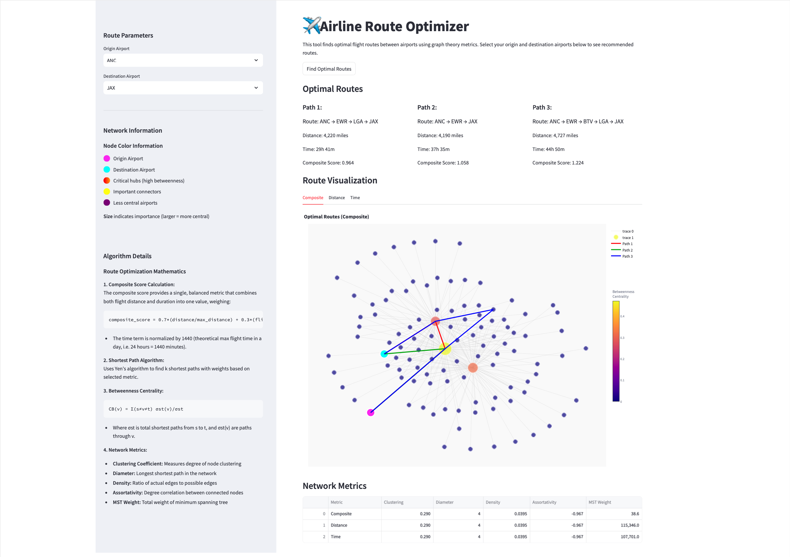
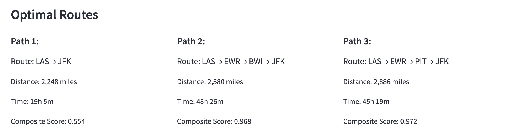
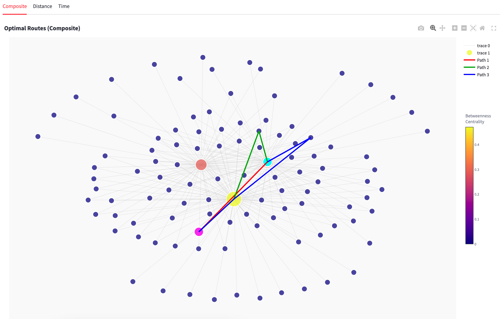
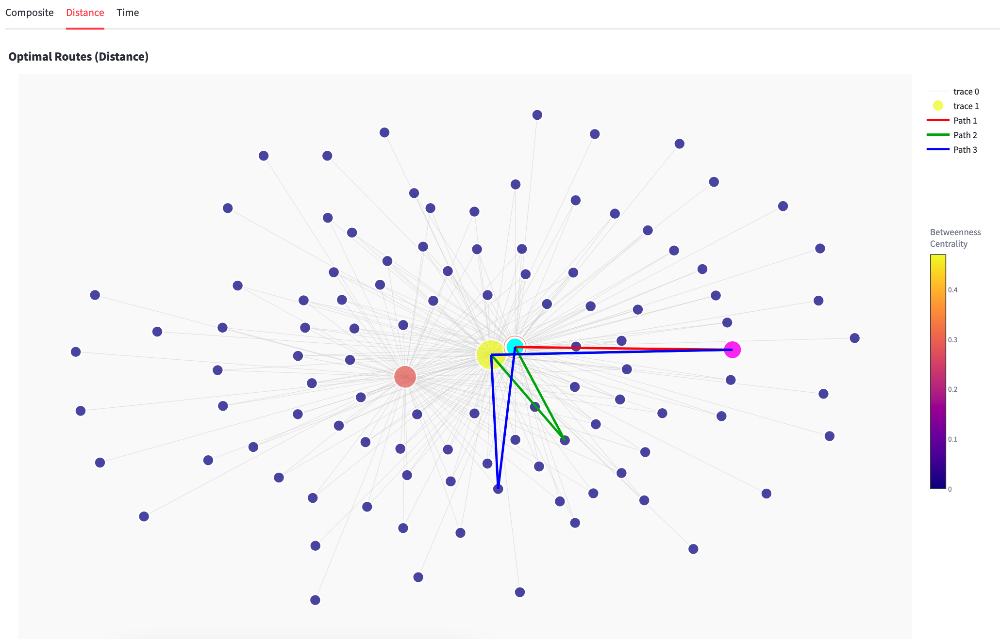
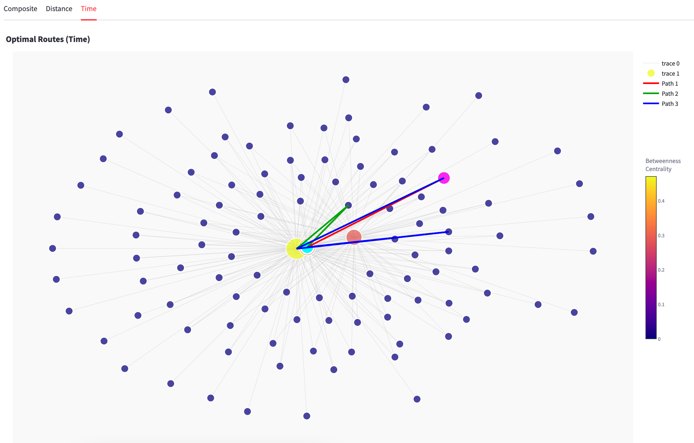
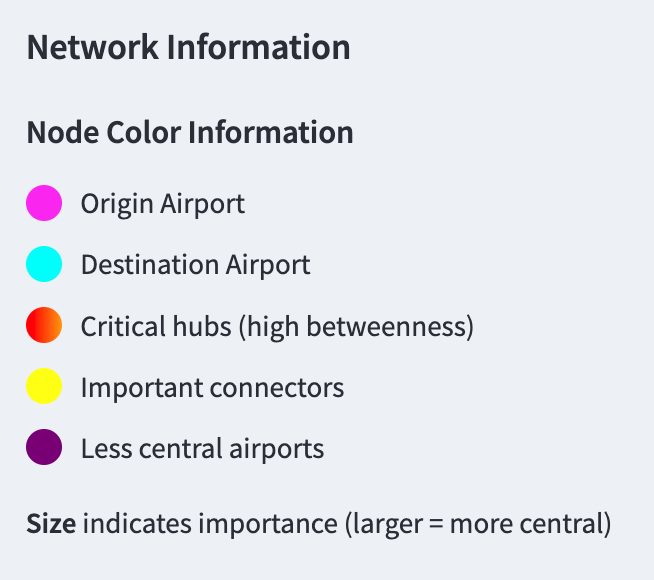
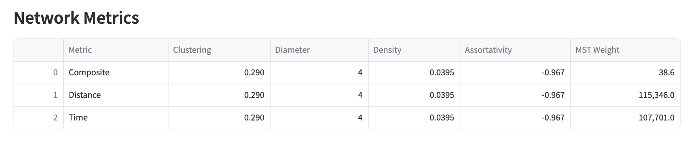

# ✈️ Airline Route Optimizer

## Project Description
The Airline Route Optimizer is a sophisticated tool that leverages graph theory and network analysis to find optimal flight routes between airports. It computes routes based on multiple metrics (distance, time, and a composite score) and provides interactive visualizations to help users understand the network structure and centrality of different airports.

## Table of Contents
- [Installation](#installation)
- [Usage](#usage)
- [Features](#features)
- [Methodology](#methodology)
- [Examples](#examples)
- [References](#references)
- [Dependencies](#dependencies)
- [Algorithms/Mathematical Concepts Used](#algorithmsmathematical-concepts-used)
- [License](#license)
- [Acknowledgments](#acknowledgments)
- [Data Source](#data-source)
- [Note](#note)

## Installation
Follow these steps to set up the Airline Route Optimizer:

1. Install required dependencies:
   ```bash
   pip install pandas networkx plotly streamlit
   ```

4. Ensure you have the flight data CSV file in the correct location. **The default path is `flights.csv` in the project root directory.**

## Usage
To run the application:

```bash
streamlit run airline_route_optimizer.py
```

Once the application is running:

1. Select your origin airport from the dropdown menu
2. Select your destination airport from the dropdown menu
3. Click "Find Optimal Routes" to see the results
4. Explore the visualization tabs to view routes based on different metrics (Composite, Distance, Time)
5. Analyze the network metrics displayed in the table at the bottom

## Features
- **Multiple Route Optimization Metrics**: Optimize routes based on distance, time, or a composite score
- **Interactive Network Visualization**: Visual representation of the flight network with highlighted optimal routes
- **Airport Centrality Analysis**: Visualization of airport importance using betweenness centrality
- **Multiple Routing Options**: Display of top 3 optimal routes between origin and destination
- **Network Statistics**: Comprehensive metrics on network properties including clustering coefficient, diameter, density, assortativity, and minimum spanning tree weight
- **User-Friendly Interface**: Intuitive Streamlit UI with dropdown menus and interactive visualizations

## Methodology
The Airline Route Optimizer follows a systematic approach:

1. **Data Loading and Preprocessing**:
   - Flight data is loaded from a CSV file
   - Distance information is extracted directly
   - Flight times are converted from hours and minutes to total minutes
   - Composite scores are calculated as weighted averages of normalized distance and time

2. **Network Construction**:
   - Three different weighted graphs are created (distance, time, composite)
   - Each airport becomes a node in the graph
   - Flights between airports become edges with appropriate weights

3. **Layout Computation**:
   - Spring layout algorithm positions nodes for visualization
   - Force-directed placement ensures meaningful spatial arrangement

4. **Route Finding**:
   - Yen's k-shortest paths algorithm identifies optimal routes
   - Routes are ranked according to the selected metric
   - For each route, all metrics are computed for comparison

5. **Network Analysis**:
   - Betweenness centrality identifies critical hub airports
   - Clustering coefficient measures airport grouping tendencies
   - Network diameter shows maximum separation between airports
   - Density measures network connectivity
   - Assortativity examines hub connection patterns
   - Minimum spanning tree weights identify network efficiency

6. **Visualization**:
   - Base network display shows all airports and routes
   - Node size and color encode betweenness centrality
   - Optimal routes are highlighted with distinct colors
   - Origin and destination airports receive special markers
   - Interactive features allow hovering for detailed information

## Examples
The following are the sample images of the web interface:

| *Sample image of User Streamlit Web Interface* |
|:--:| 
|  |

| *Sample image of Optimal Routes* |
|:--:| 
|  |

| *Sample image of Route Visulization based on Composite Score* |
|:--:| 
|  |

| *Sample image of Route Visulization based on Distance* |
|:--:| 
|  |

| *Sample image of Route Visulization based on Time* |
|:--:| 
|  |

| *Sample image of Network Information* |
|:--:| 
|  |

| *Sample image of Network Metrics* |
|:--:| 
|  |

## References

### Graph Theory Fundamentals
1. Newman, M. E. J. (2010). *Networks: An Introduction*. Oxford University Press.
2. Bondy, J. A., & Murty, U. S. R. (2008). *Graph Theory*. Springer.
3. West, D. B. (2000). *Introduction to Graph Theory* (2nd ed.). Prentice Hall.

### Shortest Path Algorithms
4. Yen, J. Y. (1971). Finding the k shortest loopless paths in a network. *Management Science*, 17(11), 712-716.
5. Dijkstra, E. W. (1959). A note on two problems in connexion with graphs. *Numerische Mathematik*, 1(1), 269-271.
6. Eppstein, D. (1998). Finding the k shortest paths. *SIAM Journal on Computing*, 28(2), 652-673.

### Network Centrality Measures
7. Freeman, L. C. (1977). A set of measures of centrality based on betweenness. *Sociometry*, 40(1), 35-41.
8. Brandes, U. (2001). A faster algorithm for betweenness centrality. *Journal of Mathematical Sociology*, 25(2), 163-177.
9. Borgatti, S. P. (2005). Centrality and network flow. *Social Networks*, 27(1), 55-71.

### Network Visualization
1. Hagberg, A., Swart, P., & Schult, D. (2008). Exploring network structure, dynamics, and function using NetworkX. In Proceedings of the 7th Python in Science Conference (SciPy 2008).
2. Kamada, T., & Kawai, S. (1989). An algorithm for drawing general undirected graphs. *Information Processing Letters*, 31(1), 7-15.

## Dependencies
- Python 3.7+
- pandas
- networkx
- plotly
- streamlit
- itertools (standard library)
- typing (standard library)

## Algorithms/Mathematical Concepts Used

### 1. Composite Score Calculation
The composite score balances distance and time considerations:

$$\text{composite score} = 0.7 \times \frac{\text{distance}}{\text{max distance}} + 0.3 \times \frac{\text{flight time}}{1440}$$

Where:
- Distance is normalized by the maximum distance in the dataset
- Flight time is normalized by 1440 (minutes in a day)
- Weights (0.7 and 0.3) can be adjusted based on user preferences

### 2. Yen's K-Shortest Paths Algorithm
Used to find multiple optimal paths between airports:

$$A_k = \{ \text{path}_1, \text{path}_2, \ldots, \text{path}_k \}$$

Where each path is computed iteratively by finding deviations from previously found paths.

### 3. Betweenness Centrality
Measures the importance of an airport in the network:

$$C_B(v) = \sum_{s \neq v \neq t} \frac{\sigma_{st}(v)}{\sigma_{st}}$$

Where:
- $\sigma_{st}$ is the total number of shortest paths from node s to node t
- $\sigma_{st}(v)$ is the number of those paths that pass through node v

### 4. Spring Layout Algorithm
For visualizing the network through force-directed placement:

$$\vec{F}_{spring}(d) = -k \times (d - d_0)$$

Where:
- $d$ is the distance between nodes
- $d_0$ is the natural spring length
- $k$ is the spring constant

### 5. Graph Theory Metrics
- **Clustering Coefficient**: $C_i = \frac{2e_i}{k_i(k_i-1)}$ where $e_i$ is the number of edges between neighbors of node $i$
- **Network Diameter**: $\text{diameter} = \max_{u,v \in V} d(u,v)$ where $d(u,v)$ is the shortest path distance
- **Network Density**: $\text{density} = \frac{2m}{n(n-1)}$ where $m$ is the number of edges and $n$ is the number of nodes
- **Assortativity**: Pearson correlation coefficient between degrees of connected nodes
- **Minimum Spanning Tree**: Subset of edges that connect all nodes with minimum total weight

## License
This project is licensed under the MIT License - see the LICENSE file for details.

## Acknowledgments
- NetworkX team for their excellent graph theory library
- Streamlit developers for the interactive web application framework
- Plotly team for the visualization capabilities

## Data Source
The application uses flight data from the `flights.csv` file, which should contain the following columns:
- `origin`: Origin airport code
- `dest`: Destination airport code
- `distance`: Flight distance in miles
- `hour`: Flight duration hours
- `minute`: Flight duration minutes

The data can be downloaded from [Kaggle](https://www.kaggle.com/datasets/mahoora00135/flights/data).
The name of the data should be default: `flights.csv`, and, placed it in project root directory.

## Note
| AI was used to generate most of the docstrings and inline comments in the code. |
|:--:|
